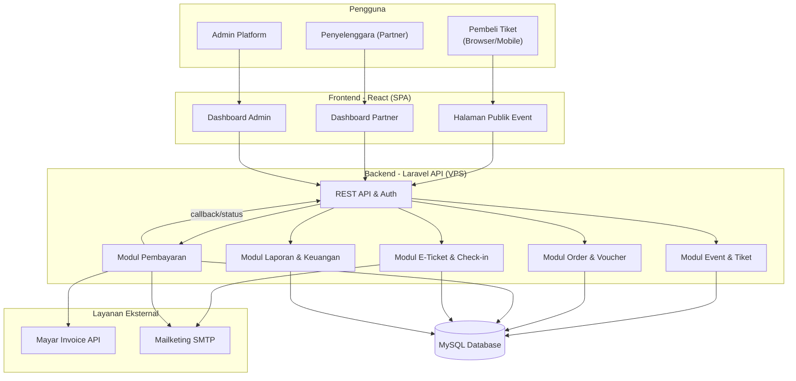
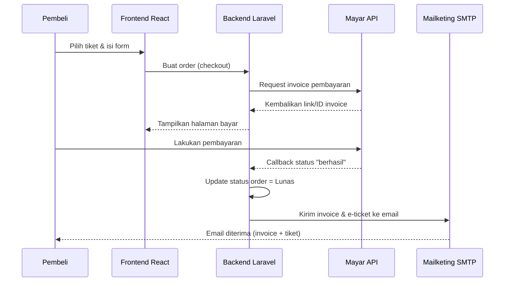
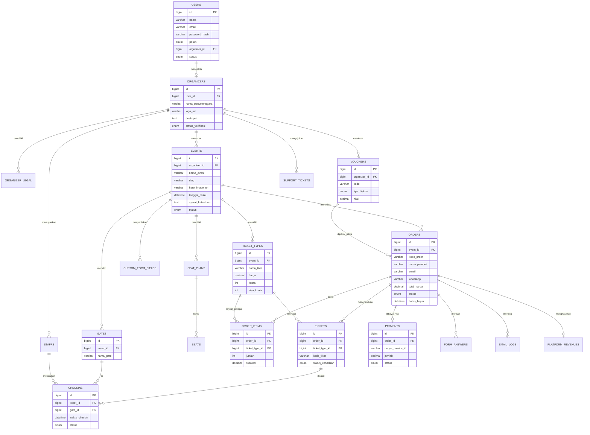

# PRD — Project Requirements Document

## 1. Overview

**Nontix** adalah platform berbasis web yang membantu penyelenggara acara membuat, memasarkan, menjual, dan mendistribusikan tiket secara mandiri — tanpa perlu membangun sistem sendiri. Selama ini banyak penyelenggara event (konser, olahraga, seminar, pameran, komunitas, lomba, wisata) kesulitan mengelola penjualan tiket karena masih manual, tersebar, dan tidak punya laporan yang rapi.

Tujuan utama aplikasi:
- **Mempermudah penyelenggara ("partner")** membuat acara, mengatur jenis tiket, kuota, dan formulir data pembeli, lalu memantau penjualan lewat satu dashboard.
- **Mempermudah pembeli tiket** menemukan acara, memilih tiket, mengisi data singkat, membayar online, dan menerima invoice + tiket elektronik via email.
- **Menyediakan fondasi sistem** untuk fitur lanjutan: e-ticket dengan kode unik, check-in/redemption di pintu masuk, hingga scan tiket — siap dikembangkan pada fase berikutnya.
- **Menjadi model bisnis yang skalabel**, dengan biaya layanan **Rp 2.000 per tiket** yang dipotong otomatis dari harga tiket yang dijual partner (skema dapat berubah di masa depan).

Nama produk: **Nontix** · tagline: *"Ticket Management System"*.

Nilai jual utama (value proposition): *"Ticket Management System"* — penyelenggara cukup buat event dan bisa langsung jual tiket online dengan dashboard penjualan yang jelas, sehingga mereka **hemat waktu**.

---

## 2. Requirements

**Kebutuhan Fungsional**
- Dua jenis pengguna utama: **Penyelenggara (Partner)** dan **Admin Platform**, ditambah pembeli tiket sebagai pengguna publik.
- Partner dapat mendaftar, melengkapi profil & legalitas, membuat event, dan menjual tiket.
- Setiap event memiliki halaman publik dengan hero image, hitungan hari, syarat & ketentuan, pilihan tiket, dan denah (jika ada).
- Alur pembelian: pilih tiket → isi form → checkout → bayar → invoice & tiket via email.
- Dashboard Partner lengkap: Analisis, Data Pembeli, Data Master (event, tiket, formulir custom, voucher, gate, seat plan, staff), Keuangan, Profil & Legalitas, dan Support.
- Dashboard Admin Platform untuk memantau seluruh event, mitra, dan pendapatan biaya layanan.

**Kebutuhan Non-Fungsional**
- **Skalabilitas**: mampu menangani lonjakan traffic saat acara besar (flash sale tiket).
- **Keandalan pembayaran**: status pembayaran ter-update otomatis dan akurat.
- **Keamanan**: data pembeli & dokumen legalitas terlindungi; tiket memiliki kode unik yang tidak mudah dipalsukan.
- **Kemudahan pakai**: antarmuka sederhana untuk pengguna non-teknis.
- **Kesiapan arsitektur**: struktur data dan modul e-ticket/check-in sudah disiapkan sejak awal meski fitur penuh menyusul.

**Biaya & Monetisasi**
- Biaya layanan Rp 2.000/tiket, dipotong otomatis dari harga tiket partner.
- Ditampilkan transparan pada laporan keuangan partner (pendapatan bersih setelah potongan).

---

## 3. Core Features

Fitur disusun mengikuti kerangka roadmap yang telah disetujui, dikelompokkan per fase.

### Fase 1 — Menjual Tiket Pertama ("first win: beli event pertama")
**3.1 Halaman Event**
- **Daftar Event Aktif** — Menampilkan semua acara yang sedang dibuka beserta sisa kuota tiket.
- **Detail Event** — Hero image, hitungan hari menuju acara, syarat & ketentuan, denah lokasi (jika ada).
- **Pencarian & Kategori** — Menemukan acara berdasarkan nama atau jenis acara.
- **Pilihan Tiket** — Menampilkan beberapa jenis tiket bila satu acara punya lebih dari satu pilihan.

**3.2 Beli Tiket**
- **Form Data Pembeli** — Nama lengkap, email aktif, WhatsApp, serta akun media sosial (Instagram, TikTok, Threads) yang dapat diatur wajib/opsional oleh partner.
- **Pilih Jumlah Tiket** — Menentukan jumlah sesuai kuota yang tersedia.
- **Ringkasan Pesanan** — Melihat rincian tiket dan total harga sebelum ke pembayaran.

### Fase 2 — Pembayaran & Tiket Elektronik
**3.3 Pembayaran Online**
- **Pilih Metode Bayar** — Kanal pembayaran yang tersedia (via Mayar Invoice API).
- **Kode Voucher & Diskon** — Memasukkan kode promo untuk menurunkan harga.
- **Status Pembayaran Otomatis** — Pesanan otomatis lunas begitu pembayaran berhasil.
- **Batas Waktu Pembayaran** — Pesanan dibatalkan otomatis bila lewat batas waktu.

**3.4 Tiket & Invoice Email**
- **Invoice via Email** — Bukti pembelian dikirim otomatis ke email pembeli (melalui Mailketing SMTP).
- **Tiket Elektronik** — Tiket dengan kode unik dikirim ke email dan bisa ditunjukkan dari ponsel.
- **Kirim Ulang Tiket** — Pembeli bisa meminta tiket dikirim ulang ke email yang sama.
- **Scan Tiket di Pintu** — Petugas memindai kode tiket untuk menandai kehadiran (arsitektur disiapkan sejak awal; rilis penuh menyusul).
- **Riwayat Kehadiran** — Penyelenggara melihat siapa saja yang sudah masuk ke acara.

### Fase 3 — Kelola Event & Dashboard Penjualan
**3.5 Kelola Event & Tiket**
- **Buat & Atur Event** — Menyusun informasi acara, jadwal, dan gambar utama.
- **Jenis Tiket & Kuota** — Menentukan harga dan jumlah tiket per jenis.
- **Formulir Data Pembeli** — Memilih data yang wajib/opsional diisi pembeli.
- **Denah Tempat Duduk** — Mengatur posisi kursi bila diperlukan.
- **Staff & Gate** — Menambah petugas dan pintu masuk acara.

**3.6 Dashboard Penjualan**
- **Ringkasan Penjualan** — Jumlah tiket terjual, pendapatan, tren penjualan.
- **Data Pembeli** — Daftar pembeli beserta kontaknya.
- **Laporan Keuangan** — Pemasukan bersih setelah potongan biaya layanan Rp 2.000/tiket.
- **Ekspor Laporan** — Mengunduh data penjualan untuk diolah sendiri.

### Fase 4 — Akun & Administrasi Platform
**3.7 Akun Penyelenggara**
- **Daftar & Masuk** — Membuat akun partner dan masuk ke halaman pengelolaan.
- **Profil Penyelenggara** — Nama, logo, dan deskripsi yang tampil ke pembeli.
- **Penanggung Jawab & Legalitas** — Data penanggung jawab dan dokumen legal acara.
- **Bantuan & Dukungan** — Menghubungi tim bantuan bila ada kendala (menu Support).

**3.8 Dashboard Admin Platform**
- **Ringkasan Semua Event** — Seluruh acara & penjualan tiket di platform.
- **Kelola Mitra Penyelenggara** — Melihat dan mengatur akun partner terdaftar.
- **Pendapatan Platform** — Memantau pemasukan biaya layanan per tiket terjual.
- **Laporan & Ekspor** — Rekap data platform untuk kebutuhan internal.

> **Catatan struktur Sidebar Dashboard Partner** (mengikuti input): Analisis · Data Pembeli · Data Master (Event, Tiket, Formulir Custom, Voucher, Gate, Seat Plan, Staff) · Keuangan · Profil & Legalitas (Profil Penyelenggara, Penanggung Jawab, Legalitas) · Support · Logout.

---

## 4. User Flow

**A. Alur Pembeli Tiket (User)**
1. Pengguna membuka website **Nontix** dan melihat daftar event aktif.
2. Pengguna memilih satu event (bisa lewat pencarian/kategori).
3. Muncul halaman detail: hero image, hitungan hari, deskripsi, syarat & ketentuan, pilihan tiket, dan denah (jika ada).
4. Pengguna memilih jenis & jumlah tiket sesuai kuota yang tersedia.
5. Pengguna mengisi form: nama lengkap, email aktif, WhatsApp, Instagram, TikTok, Threads (opsional sesuai pengaturan partner).
6. Pengguna melihat ringkasan pesanan (tiket + total harga, termasuk voucher bila ada).
7. Pengguna klik **Checkout** dan diarahkan ke pembayaran melalui **Mayar Invoice API**.
8. Setelah pembayaran berhasil, status pesanan otomatis menjadi **Lunas**.
9. **Invoice** dan **e-ticket** dikirim ke email pembeli melalui **Mailketing SMTP**.
10. Saat acara, pembeli menunjukkan e-ticket untuk discan di pintu masuk.

**B. Alur Penyelenggara (Partner)**
1. Partner mendaftar & masuk ke dashboard.
2. Melengkapi Profil Penyelenggara dan data Penanggung Jawab & Legalitas.
3. Membuat event baru: informasi acara, jadwal, hero image, syarat & ketentuan, denah.
4. Menentukan jenis tiket, harga, kuota, formulir data pembeli, gate, seat plan, dan staff.
5. Event dipublikasikan → muncul di halaman publik.
6. Memantau penjualan, data pembeli, dan keuangan di dashboard.
7. Mengekspor laporan bila diperlukan; menghubungi Support bila ada kendala.

**C. Alur Admin Platform**
1. Masuk ke Dashboard Admin.
2. Memantau seluruh event & mitra penyelenggara.
3. Melihat pendapatan biaya layanan per tiket.
4. Mengelola mitra dan mengekspor laporan.

---

## 5. Architecture

Sistem dibangun dengan pola **Frontend (React) — Backend API (Laravel) — Database (MySQL)**, di-*deploy* di **VPS**. Layanan pihak ketiga yang terhubung: **Mayar Invoice API** (pembayaran) dan **Mailketing SMTP** (email invoice & e-ticket). Modul **check-in, redemption, dan scan tiket** sudah disiapkan jalur datanya sejak fase awal walau UI penuhnya menyusul.

**Alur Pembayaran (Sequence Sederhana)**

---

## 6. Database Schema

Berikut tabel utama beserta kolom/field pokoknya.

**users** — akun semua peran (admin platform, partner, staff)
- `id` (bigint, PK), `nama` (varchar), `email` (varchar, unik), `password_hash` (varchar), `peran` (enum: admin_platform, partner, staff), `organizer_id` (FK, nullable), `status` (enum: aktif, nonaktif), `created_at` (timestamp)

**organizers** — profil penyelenggara/partner
- `id` (PK), `user_id` (FK), `nama_penyelenggara` (varchar), `logo_url` (varchar), `deskripsi` (text), `status_verifikasi` (enum: pending, terverifikasi, ditolak), `created_at` (timestamp)

**organizer_legal** — data penanggung jawab & legalitas
- `id` (PK), `organizer_id` (FK), `nama_penanggung_jawab` (varchar), `no_identitas` (varchar), `dokumen_url` (varchar), `tipe_dokumen` (varchar), `status` (enum), `created_at` (timestamp)

**events** — acara yang dibuat partner
- `id` (PK), `organizer_id` (FK), `nama_event` (varchar), `slug` (varchar, unik), `deskripsi` (text), `hero_image_url` (varchar), `tanggal_mulai` (datetime), `tanggal_selesai` (datetime), `lokasi` (varchar), `syarat_ketentuan` (text), `status` (enum: draft, aktif, selesai), `created_at` (timestamp)

**ticket_types** — jenis tiket per event
- `id` (PK), `event_id` (FK), `nama_tiket` (varchar), `harga` (decimal), `kuota` (int), `sisa_kuota` (int), `max_per_order` (int), `created_at` (timestamp)

**orders** — transaksi pembelian tiket
- `id` (PK), `event_id` (FK), `kode_order` (varchar, unik), `nama_pembeli` (varchar), `email` (varchar), `whatsapp` (varchar), `instagram` (varchar), `tiktok` (varchar), `threads` (varchar), `voucher_id` (FK, nullable), `total_harga` (decimal), `biaya_layanan` (decimal), `status` (enum: pending, lunas, dibatalkan, kadaluarsa), `batas_bayar` (datetime), `created_at` (timestamp)

**order_items** — rincian tiket dalam satu order
- `id` (PK), `order_id` (FK), `ticket_type_id` (FK), `jumlah` (int), `harga_satuan` (decimal), `subtotal` (decimal)

**tickets** — e-tiket dengan kode unik
- `id` (PK), `order_id` (FK), `ticket_type_id` (FK), `kode_tiket` (varchar, unik), `nama_pemegang` (varchar), `status_kehadiran` (enum: belum_hadir, hadir), `checkin_at` (datetime, nullable)

**payments** — catatan pembayaran (Mayar)
- `id` (PK), `order_id` (FK), `mayar_invoice_id` (varchar), `metode` (varchar), `jumlah` (decimal), `status` (enum: pending, berhasil, gagal), `paid_at` (datetime, nullable)

**vouchers** — kode promo/diskon
- `id` (PK), `organizer_id` (FK), `event_id` (FK, nullable), `kode` (varchar, unik), `tipe_diskon` (enum: nominal, persen), `nilai` (decimal), `kuota` (int), `berlaku_mulai` (date), `berlaku_sampai` (date), `status` (enum)

**custom_form_fields** — form data pembeli yang dapat diatur partner
- `id` (PK), `event_id` (FK), `label` (varchar), `tipe` (enum: teks, email, nomor, sosial), `wajib` (boolean), `urutan` (int)

**form_answers** — jawaban form pembeli
- `id` (PK), `order_id` (FK), `field_id` (FK), `nilai` (text)

**gates** — pintu masuk acara
- `id` (PK), `event_id` (FK), `nama_gate` (varchar), `status` (enum: aktif, nonaktif)

**seat_plans** — denah tempat duduk
- `id` (PK), `event_id` (FK), `nama_denah` (varchar), `layout_url` (varchar)

**seats** — detail kursi dalam denah
- `id` (PK), `seat_plan_id` (FK), `kode_kursi` (varchar), `baris` (varchar), `kategori` (varchar), `status` (enum: tersedia, terisi)

**staffs** — petugas/pengelola acara
- `id` (PK), `organizer_id` (FK), `event_id` (FK), `nama` (varchar), `email` (varchar), `gate_id` (FK, nullable), `peran` (varchar)

**checkins** — riwayat kehadiran & redemption (fondasi scan tiket)
- `id` (PK), `ticket_id` (FK), `gate_id` (FK, nullable), `staff_id` (FK, nullable), `waktu_checkin` (datetime), `status` (enum: berhasil, gagal)

**platform_revenues** — pendapatan biaya layanan platform
- `id` (PK), `order_id` (FK), `jumlah_tiket` (int), `biaya_per_tiket` (decimal, default 2000), `total_biaya` (decimal), `created_at` (timestamp)

**email_logs** — catatan pengiriman invoice & e-ticket
- `id` (PK), `order_id` (FK), `tipe` (enum: invoice, e_ticket), `email_tujuan` (varchar), `status_kirim` (enum: terkirim, gagal), `waktu_kirim` (datetime)

**support_tickets** — permintaan bantuan partner
- `id` (PK), `organizer_id` (FK), `subjek` (varchar), `pesan` (text), `status` (enum: terbuka, diproses, selesai), `created_at` (timestamp)

---

## 7. Tech Stack

**Frontend**
- **React** — antarmuka SPA untuk halaman publik event, dashboard partner, dan dashboard admin.
- **Tailwind CSS + komponen UI** — mempercepat pembuatan tampilan yang konsisten dan responsif.

**Backend**
- **Laravel** (PHP) — REST API, autentikasi & otorisasi per peran (admin platform, partner, staff), logika order, voucher, pembayaran, dan laporan.
- **Queue & Scheduler Laravel** — untuk pengiriman email invoice/e-ticket dan pembatalan otomatis order yang melewati batas waktu.

**Database**
- **MySQL** — penyimpanan data event, tiket, order, pembayaran, dan check-in.

**Integrasi Pihak Ketiga**
- **Mayar Invoice API** — pembayaran online & callback status pembayaran.
- **Mailketing SMTP** — pengiriman invoice dan e-ticket ke email pembeli.

**Deployment & Infrastruktur**
- **VPS** — hosting backend Laravel, frontend React, dan MySQL.
- **Nginx + SSL** — web server & keamanan koneksi.
- **Backup berkala** — melindungi data transaksi dan dokumen legalitas.

**Catatan Pengembangan Berikutnya**
- Modul **e-ticket penuh, check-in/redemption, dan scan tiket** telah disiapkan struktur datanya (tabel `tickets`, `gates`, `checkins`, `staffs`) sehingga dapat diaktifkan tanpa perombakan besar.